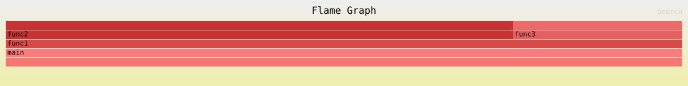

# 收集堆栈合并与绘制火焰图
[](https://github.com/yangrudan/collect_draw_r/actions/workflows/rust.yml)

## 0x01 介绍

>堆栈合并（Stack Merging）是一种技术，用于将多个调用堆栈中的信息汇总到一起，以便于分析和优化。
>
>火焰图则是一种图形化工具，通过可视化的方式展示函数调用的层次和时间分布，帮助开发者快速定位性能瓶颈。

### 1. 收集数据
**前置条件**: 确保已经启用了性能分析工具Probing网页服务，并且已经生成了性能分析数据.

### 2. 堆栈合并
收集多个rank堆栈信息并进行合并.

### 3. 火焰图绘制
定制化火焰图生成.

## 0x02 使用方式

准备工作(提供堆栈)
```bash
❯ cd /home/yang/worksapce/demangle_l                                                                                                                      
❯ source /home/yang/worksapce/probing/venv/bin/activate
❯ PROBING=1 PROBING_PORT=9922 python main.py     
```

**修改urls.json**

```
❯ cd /home/yang/worksapce/collect_draw_r                                                                                                                      
❯ cargo run
```

## 0x03 运行结果




## 0x04 Output文件说明

- `urls.json` 为模拟的请求;
- `response.json` 为单进程收集数据;
- `output.json` 为模拟4进程收集的数据;
- `processed_stacks.txt` 为json转换成一维txt;
- `merged_stacks.txt` 为合并后的堆栈信息;
- `mmm.svg` 测试堆栈合并火焰图;
- `flamegraph.svg` 为生成的火焰图;

## 0x05 优化文档

详细的优化设计文档请参见 [优化设计文档](./docs/优化设计文档.md)，包含：

- **PR#9**: 内存安全、错误处理和网络弹性优化
- **PR#10**: 10000+ URL请求的性能优化

主要改进：
- ✅ 20倍性能提升（10000+ URLs场景）
- ✅ 75%内存使用降低
- ✅ 完善的错误处理机制
- ✅ 增强的网络弹性和并发控制
